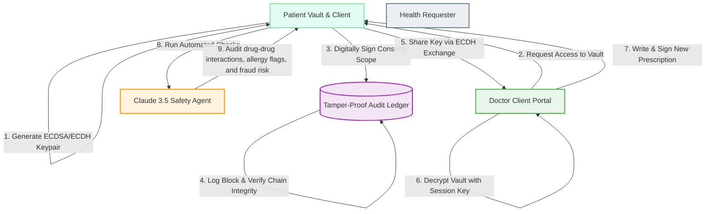

# 🧬 PrescriptionNet: Zero-Trust Cryptographic Health Vault & Clinical AI Ledger

[](https://nextjs.org)
[](https://www.typescriptlang.org)
[](https://tailwindcss.com)
[](#cryptographic-infrastructure)
[](https://firebase.google.com)
[](#ai-clinical-safety--fraud-detection)

PrescriptionNet is a secure, role-based, zero-trust digital health record and prescription sharing platform. It empowers patients with complete ownership over their medical history by combining **end-to-end Web Cryptography**, a **tamper-proof audit ledger** implemented as an in-browser SHA-256 hash-chain, **granular cryptographic consent scopes**, and autonomous **AI-powered clinical safety and fraud detection agents**.

---

## 🏗️ System Architecture & Workflow

The platform maintains a strict zero-trust posture: sensitive patient health vaults remain encrypted locally and can only be accessed or modified under explicit, cryptographically signed patient consent. 



---

## 🔒 Core Technical Pillars

### 1. Cryptographic Infrastructure (Web Crypto API)
All core operations rely on standard Web Cryptography algorithms executed exclusively on client browsers to ensure that even database storage administrators cannot read patient records:
*   **Asymmetric Keypairs (ECDSA & ECDH)**: 
    *   **ECDSA (P-256)**: Used for signing and verifying digital authorizations, consent forms, and medical records.
    *   **ECDH (P-256)**: Used for Diffie-Hellman key exchanges between patients and doctors to securely negotiate symmetric session keys.
*   **Symmetric Encryption (AES-GCM 256-bit)**: Each patient's medical vault is symmetrically encrypted.
*   **Key Derivation (PBKDF2)**: Patient secrets and vault master keys are protected using a password-derived key using `PBKDF2` with **100,000 iterations** and SHA-256 hashing.
*   **Zero Knowledge Approach**: Patient private keys remain stored in the browser's session keystore (`sessionStorage`/`localStorage`) and are never sent to external servers or Firebase.

### 2. Tamper-Proof Audit Ledger (SHA-256 Hash Chain)
The platform logs all access requests, consent grants, revokings, and emergency overrides in a sequential audit ledger.
*   **Hash-Linked Blocks**: Every log entry contains the index, event type, patient ID, requester ID, consent scope, timestamp, and a custom transaction hash. 
*   **Previous Hash Pointer**: Each block contains a `previousHash` pointing directly to the previous block's `transactionHash`, mirroring a blockchain architecture.
*   **Active Integrity Validation**: The platform implements a live verifier (`verifyLedgerIntegrity()`) that re-computes every block hash dynamically and verifies that no historic records have been modified. If any block data is tampered with, the chain is broken, and alert banners are raised instantly.

### 3. AI Clinical Safety & Fraud Detection (Claude 3.5 Sonnet)
When prescriptions or medical histories are modified, the system automatically routes the anonymized payload through a dual-layered audit system:
*   **Rule-Based Auditing (`fraudRules.ts`)**: 
    *   *Doctor Shopping*: Flags if the same drug is prescribed by $\ge 3$ different doctors.
    *   *Duplicate Fill*: Identifies when the same drug from the same doctor is filled twice within 7 days.
    *   *Rapid Repeat*: Monitors controlled substances (e.g., Tramadol, Alprazolam) prescribed $\ge 2$ times within 30 days.
    *   *Unusual Dosage*: Cross-references drug amounts against clinical maximum thresholds (e.g., Tramadol > 400mg).
*   **AI-Powered Safety & Interaction Audits**: Integrates Anthropic's Claude 3.5 Sonnet to autonomously detect:
    *   *Drug-Drug Interactions*: e.g., co-prescribing Warfarin (anticoagulant) and Aspirin (antiplatelet) increasing internal bleeding risk, or Sertraline + Tramadol increasing risk of Serotonin Syndrome.
    *   *Drug-Allergy Conflicts*: Scans patient allergy lists against ingredients and drug classes.
    *   *Medication Safety Risks*: Generates structured warnings and an overall clinical safety risk rating (SAFE, LOW, MEDIUM, HIGH).

### 4. Granular Consent Scopes & Emergency Break-Glass
Patients maintain fine-grained, revocable consent over their records.
*   **Consent Scopes**: Access can be limited to `"Prescriptions Only"`, `"Lab Reports Only"`, `"Allergies Only"`, or `"Full Medical History"`.
*   **Revocation**: Consent can be revoked instantly by the patient, which immediately breaks the key exchange and updates the cryptographic ledger.
*   **Break-Glass Protocol**: In life-threatening scenarios, doctors can activate an emergency override. This logs an immediate `"EMERGENCY_ACCESS_USED"` entry on the ledger, alerts the patient, bypasses standard key gates using an emergency backup vault key, and starts a countdown timer monitoring the emergency window.

---

## 👤 Role-Based User Portals

| Role | Key Capabilities | Security Clearance |
| :--- | :--- | :--- |
| **Patient** | • View decrypted health vaults & download data JSON<br>• Manage active consents & revoke access<br>• View live tamper-proof audit trails<br>• Configure biometric 2FA & Emergency Access toggles | Owns private master key and data decryption capability. |
| **Doctor** | • Create cryptographic identity<br>• View authorized patient vaults (decrypted on-the-fly)<br>• Prescribe medications & sign them digitally<br>• Perform AI clinical safety checks & read drug summaries | Access limited to valid, signed active consent tokens. |
| **Requester** | • Request patient health data under specific scopes<br>• View verification status of records<br>• Check the global ledger for audit events | Read-only access to specifically scoped, verified datasets. |

---

## 📂 Project Directory Structure

The Next.js application is cleanly structured:

```text
APEX/
└── prescriptionnet-app/
    ├── src/
    │   ├── app/
    │   │   ├── ai-test/          # Dev utilities for clinical safety testing
    │   │   ├── api/
    │   │   │   ├── fraud/        # Claude AI fraud checking endpoints
    │   │   │   └── safety/       # Claude AI safety analysis endpoints
    │   │   ├── doctor/           # Doctor role views, signing panel
    │   │   ├── patient/          # Patient role dashboard, ledger logs
    │   │   ├── requester/        # Health data requester interface
    │   │   ├── globals.css       # Design tokens, custom animations & glow effects
    │   │   └── page.tsx          # Landing/Role Selector and Firebase login Page
    │   ├── components/
    │   │   ├── ai/               # Safety metrics, gauges, explainability reports
    │   │   ├── consent/          # Access request forms, consent dashboards
    │   │   ├── crypto/           # Crypto debug, ECDSA/ECDH tools, Biometrics
    │   │   ├── dashboard/        # Emergency access, countdown timers, stats
    │   │   ├── ledger/           # Audit logs, chain verifiers
    │   │   ├── ui/               # Core button & utility components
    │   │   └── vault/            # Medical record additions, vault displays
    │   ├── data/
    │   │   └── mockData.ts       # Preloaded patient, doctor, and history datasets
    │   ├── lib/
    │   │   ├── crypto.ts         # ECDSA/ECDH/AES-GCM Web Crypto implementations
    │   │   ├── ledger.ts         # Ledger block construction & verification logic
    │   │   ├── fraudRules.ts     # Rules-based drug patterns
    │   │   └── firebase.ts       # Firebase SDK initialization
    │   └── types/
    │       └── index.ts          # Core TypeScript interface definitions
    ├── tailwind.config.ts        # Custom theme extensions, fonts, glows
    └── package.json              # Next.js configurations & core dependencies
```

---

## 🛠️ Setup & Installation

Follow these steps to run PrescriptionNet on your local machine:

### 1. Prerequisites
Ensure you have **Node.js** (v18 or higher) and **npm** installed.

### 2. Clone and Navigate
```bash
git clone <repository-url>
cd APEX/prescriptionnet-app
```

### 3. Install Dependencies
```bash
npm install
```

### 4. Environment Configuration
Create a `.env.local` file in the `prescriptionnet-app/` directory:
```env
# Choose either Anthropic API or OpenRouter to power the Claude AI Agents
# (If neither key is provided, the application automatically runs in Simulated Mode)
ANTHROPIC_API_KEY=your_anthropic_api_key_here
# OR
OPENROUTER_API_KEY=your_openrouter_api_key_here
```

### 5. Running Locally
Launch the Next.js development server:
```bash
npm run dev
```
Open [http://localhost:3000](http://localhost:3000) in your browser.

### 6. Mock Data & Accounts
For immediate testing, navigate to the **Mock Accounts** tab on the login screen. The database is preloaded with:
*   **Patients**: *Rajesh Kumar* (preloaded with multiple active/duplicate medications for safety flags), *Ananya Singh*, *Amit Patel*.
*   **Doctors**: *Dr. Sarah Connor*, *Dr. Alan Grant*.
*   **Requesters**: *Apex Insurance Group*.

---

## 🔬 Cryptographic Debug Panel

PrescriptionNet includes an interactive **Cryptographic Debug Panel** (accessible under the Doctor/Patient workflows) designed to make the zero-trust operations visual:
1.  **Key Pair Visualization**: View your active ECDSA signing public/private keys and ECDH encryption keys in raw JWK (JSON Web Key) format.
2.  **Encryption/Decryption Sandbox**: Type messages to encrypt them using the symmetric AES-GCM engine, see the output initialization vector (IV), ciphertext, and decrypt them in real-time.
3.  **Digital Signature Verification**: Verify that a patient's consent document remains authentic by tampering with the text and watching the digital signature verification immediately fail.
4.  **Ledger Integrity Checker**: Intentionally modify localStorage records to see how `verifyLedgerIntegrity()` instantly detects the mismatch and highlights the compromised block index.

---

## 🛡️ Security Principles Enforced
*   **Zero-Knowledge Storage**: Vault contents are symmetrically encrypted with a user-derived key *before* reaching the state manager, ensuring total privacy.
*   **Local Secret Generation**: Keys are generated using secure entropy pools provided by the browser's `window.crypto.subtle` API.
*   **Auditability**: Actions generate cryptographic proofs recorded on the ledger, assuring accountability.
*   **Revocation Audits**: Revoking permissions destroys shared keys locally, blocking subsequent decryption pipelines.
